# Capturas

[← voltar](../README.md)

Telas do Kulto rodando, com dados reais — e as peças da marca.

## Marca

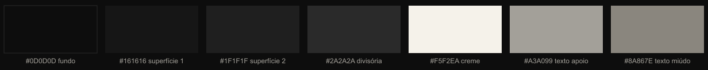

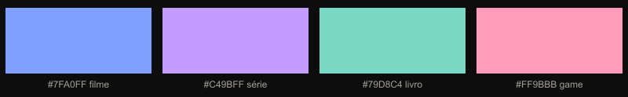

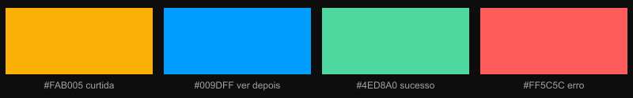

---

## Entrada

Os cartazes se revezam na coluna da direita. Este é o da série: cartão de
episódio, com marquee repetido e `EP. 4 DE 8 · 03:47` no pé.

## Início

Feed cronológico. A aba "Seguindo" mostra quem você segue; "Explorar", o
Kulto inteiro.

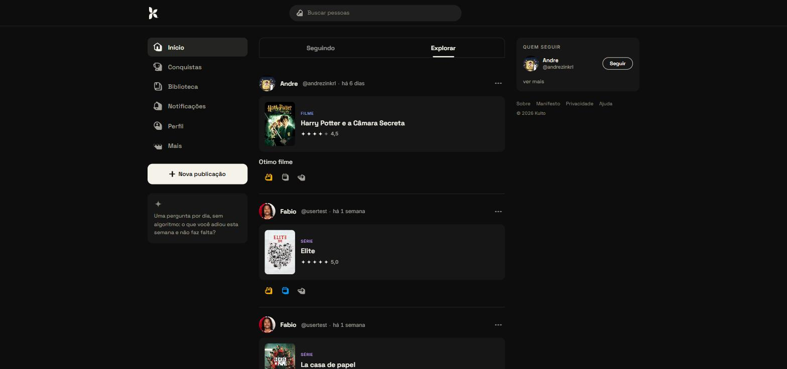

## Perfil

Capa cortando reto na metade da foto, vitrine de conquistas, favoritos e as
cinco reviews mais recentes.

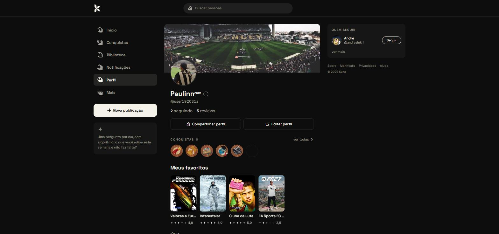

## Acervo

Abre pelo "Ver acervo de…" quando há mais de cinco reviews. O balanço no topo
mostra o peso de cada mídia; a lista filtra por mídia em chips.

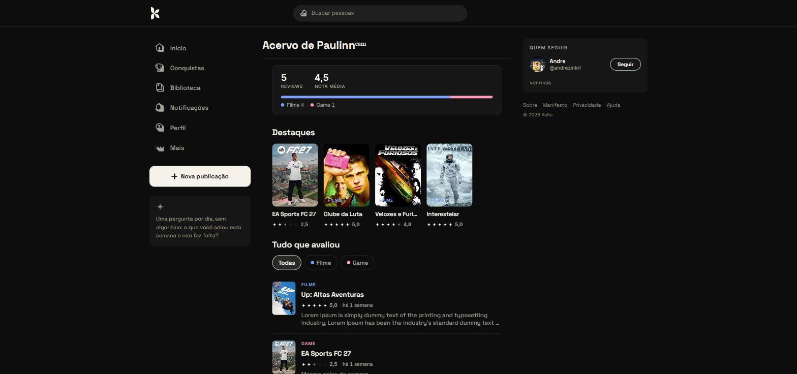

## Nova review

A nota não é um número: são quatro critérios, e eles mudam conforme a mídia.

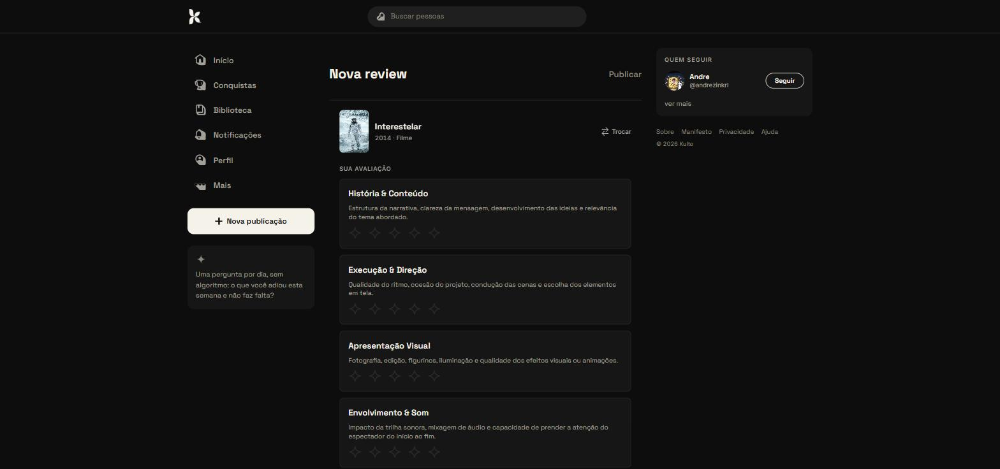

## Detalhe da review

No celular esta tela sobe como folha, parando a 80% da altura. No computador,
ocupa a coluna do meio.

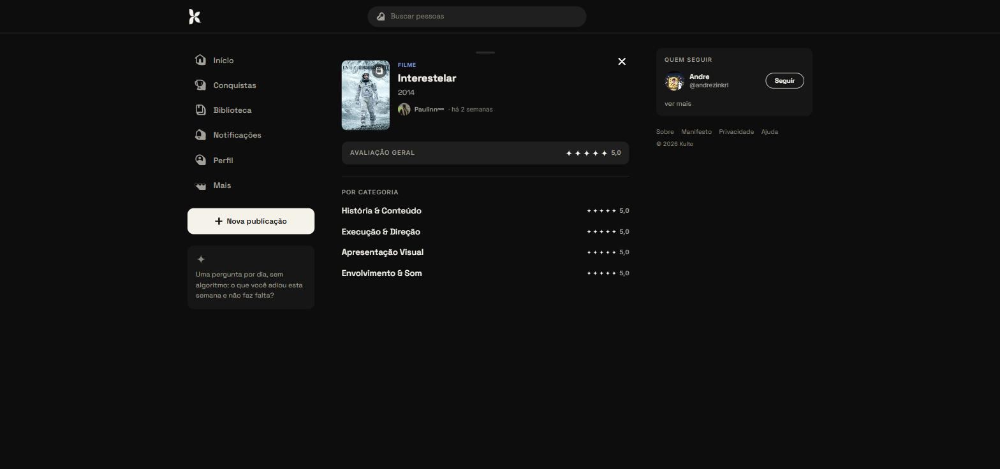

## Notificações

Curtidas na mesma review viram uma linha só, com as fotos lado a lado.

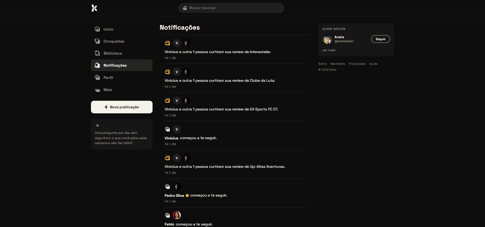

## Conquistas

Dez conquistas em quatro níveis. As bloqueadas mostram o progresso.

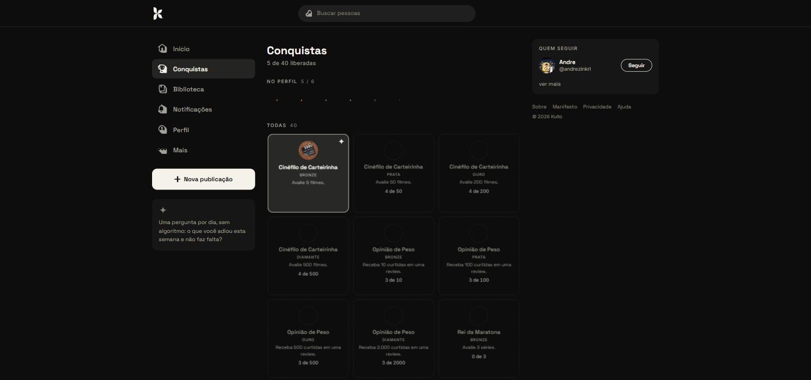

## Baixar

O app ainda não está nas lojas, e a tela diz isso de frente — com o passo a
passo de instalação abrindo já no sistema de quem está lendo.

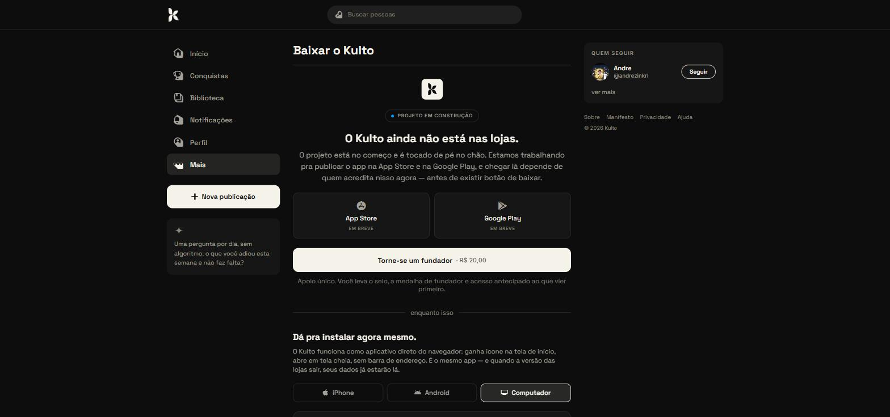
